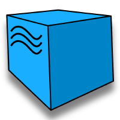
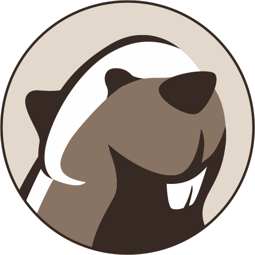
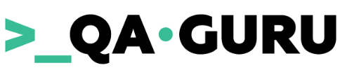

# Hello! 

## About me
 My name is Yuliya. 👩‍💻
 I'm an aspiring QA Automation engineer with a focus on Python. 
 I have around 1.5 years of experience in manual testing. 
 My passion for technology and my desire to create high-quality software inspire and drive me to further develop in the QA field. 

## Tools and technologies:

  <code></code>
  <code></code>
  <code></code>
  <code></code>
  <code></code>
  <code></code>
  <code></code>
  <code></code>
  <code></code>
  <code></code>
  <code></code>
  <code></code>
  <code></code>
  <code></code>
  <code></code>

## Education:

  

  

## Projects:
- [API](https://github.com/YuliyaShkretova/qa_guru_API)
- [UI](https://github.com/YuliyaShkretova/qa_guru_UI) 
